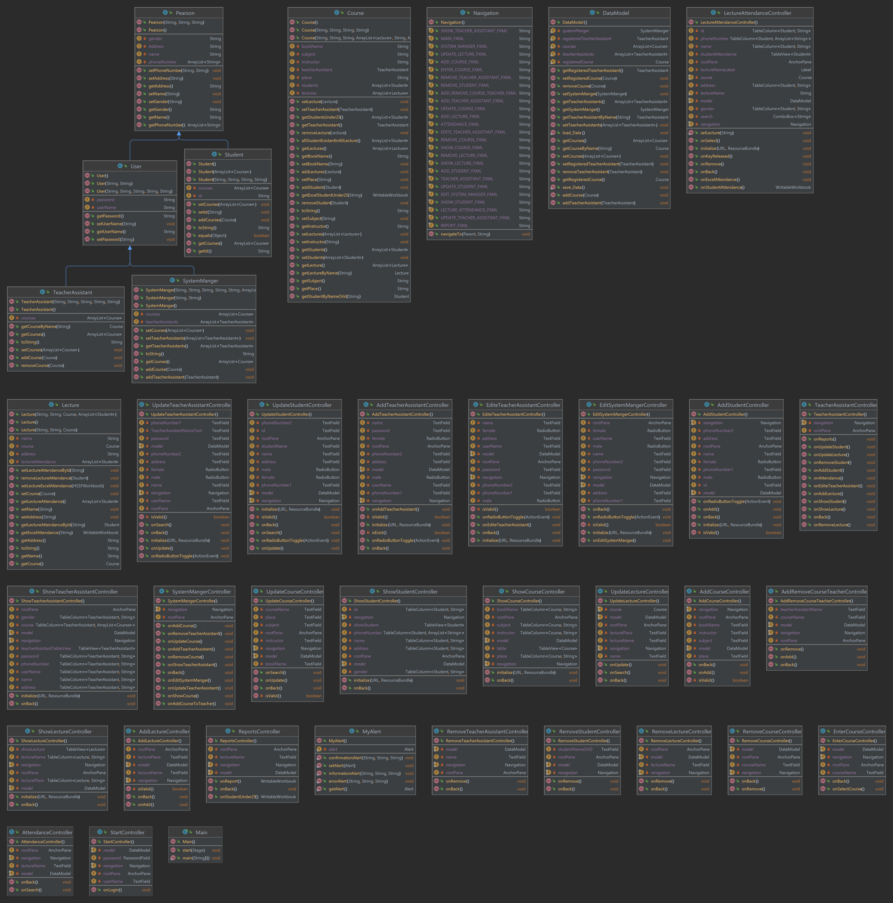

# Student Attendance Management System

[](https://github.com/MahmoudAlmodalal/student-attendance-management-system/actions/workflows/build.yml)
[](https://raw.githack.com/MahmoudAlmodalal/student-attendance-management-system/main/docs/index.html)

A modular **JavaFX desktop application** for managing university courses, teaching assistants, students, lectures, attendance records, and exportable reports.

> **Live showcase:** [Open the public project page](https://raw.githack.com/MahmoudAlmodalal/student-attendance-management-system/main/docs/index.html)
>
> The application itself is desktop-based and cannot run directly inside a browser. The public page is therefore a responsive project showcase and setup hub, while the full application runs locally with JavaFX.

## Features

The system provides a complete attendance workflow for two roles:

| Area | Capabilities |
| --- | --- |
| Course management | Create, update, remove, search, and assign courses. |
| User management | Manage system-manager and teaching-assistant accounts. |
| Student management | Register, update, remove, and assign students to courses. |
| Lecture management | Add, edit, remove, and list lectures within a course. |
| Attendance | Record, remove, import, and review attendance by lecture. |
| Reporting | Export lecture attendance, individual student summaries, and students at or below the 25% attendance threshold. |
| Persistence | Save local application data under `StudentAttendanc/data/attendance-data.dat`. |

## Technology Stack

| Component | Technology |
| --- | --- |
| Language | Java 21 |
| UI | JavaFX 21 with FXML |
| Build | Apache Maven |
| Spreadsheet reports | Apache POI 5.4.1 |
| Architecture | Java modules with MVC-style controllers and models |
| Documentation | Static `docs/` page with public showcase link |

## Requirements

Install **JDK 21** and **Maven 3.8+**. An IDE such as IntelliJ IDEA with JavaFX support is optional; the project can be built from the command line.

## Quick Start

```bash
git clone https://github.com/MahmoudAlmodalal/student-attendance-management-system.git
cd student-attendance-management-system/StudentAttendanc
mvn clean javafx:run
```

To build the project without launching the UI:

```bash
mvn clean package
```

The JavaFX Maven plugin downloads the required platform-specific JavaFX artifacts automatically. The application stores local data in the ignored `data/` directory after the first save.

## Default Login

A fresh installation initializes the system-manager account with the following credentials:

| Field | Value |
| --- | --- |
| Username | `admin` |
| Password | `admin@gmail.com` |

Change the credentials from the system-manager screen after the first login. Teaching-assistant accounts can be created after a course has been registered.

## Project Structure

```text
student-attendance-management-system/
├── StudentAttendanc/
│   ├── pom.xml
│   └── src/
│       └── main/
│           ├── java/
│           │   ├── module-info.java
│           │   └── com/studentattendance/
│           │       ├── controllers/
│           │       └── models/
│           └── resources/
│               └── com/studentattendance/
│                   ├── images/
│                   └── views/
├── docs/
│   ├── index.html
│   └── assets/
└── .github/workflows/build.yml
```

## Architecture

The application separates JavaFX event handling into controllers, domain and persistence logic into models, and screen layout into FXML resources. Navigation is centralized in `Navigation.java`, while `DataModel.java` provides local serialization and safe initialization of the application state.

The original Excel export implementation was consolidated on Apache POI. This removes the obsolete JXL dependency and provides a single maintained library for report generation and attendance import.



## Project Page

The static project page is stored in [`docs/index.html`](docs/index.html). A public preview is available through [this live showcase link](https://raw.githack.com/MahmoudAlmodalal/student-attendance-management-system/main/docs/index.html), while the source remains fully versioned inside the repository. The page includes the project overview, feature summary, setup instructions, default login information, architecture diagrams, and a direct link back to the source repository. The `docs/` folder is also ready to be used as the source for GitHub Pages when Pages administration is enabled for the repository.

## Continuous Integration

Every push and pull request targeting `main` runs `.github/workflows/build.yml`. The workflow installs Java 21, enables Maven dependency caching, and executes `mvn clean package` from the `StudentAttendanc` module.

## License

No license has been specified yet. Add a license file before distributing the application publicly.
    